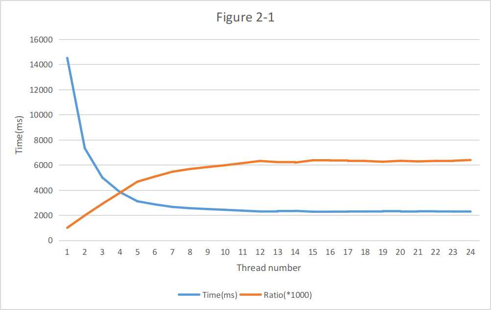

# Lab1 test report

Group: YouJiSuan

Members: Bangbo Liang	Qi Shen	Xinyu Wang	Yifan Zhou

## 1.Lab summary

​	Multithreading is one of the high-performance programming technologies. Our  lab 1 will compare the performance differences between multithreading and single thread, the performance differences between different code implementations of the same function, and the performance differences of multithreading in different hardware environments.

### 1.1 Input

​	The program use standard input method in the console. The input should be a file that contains a lot of sudoku puzzles in a specific directory. And every sudoku puzzle should be stored in the input file in a fixed format.

### 1.2 Output

​	The program will get all puzzles from the input file and output all solution of the input puzzle sequence. Besides, the output sequence order should be the same as input sequence.

### 1.3 Sudoku Algorithms

​	In our lab, four differents algorithms are provided: Basic, Dancing link, Min arity, Min arity cache. Dancing link is the fastest algorithm among them, while Basic is the slowest. In our group's solution, we used Min arity cache. This is the fastest algorithm but dancing link.

### 1.4 Performance Index

​	In the lab, the time required to solve all the Sudoku questions in a single input file and write the Sudoku solutions to the stadnard output in the console in order is used as a performance indicator.

​	Generally speaking, the speedup ratio can be used to visually express the performance difference between a parallel program and a serial program (speedup ratio: the ratio of serial execution time to parallel execution time, which is a specific comparison between serial and parallel execution time index).

​	

### 1.5 Lab Environment

​	In this lab we used 2 diffrerent environments: ENV1 and ENV2.

​	ENV1: Run on an Arch Linux physical machine(core version 5.1.11), 16GB RAM, CPU is Intel(R) Core(TM) i7-8700 CPU @ 3.20GHz, 6 physical CPU core, every physical CPU has 2 logic cores, 12 cores in total.

​	ENV2:Run on a  Ubuntu 20.04 server machine(core version  5.4.0), 2GB RAM, CPU Intel(R) Xeon(R) Platinum 8269CY CPU @ 2.50GHz, 1 physical CPU core, every physical CPU has 2 logic core, 2 cores in total.

### 1.6 Code Implementation Version

​	Two different codes are used in this lab:

​	Code1: The native Sudoku solving code provided in this lab, can only be run in single-threaded mode.

​	Code2: To meet the multi-threading and a series of modifications and additions made in the Code1. In Code2, the number of threads that can be controlled by adjusting the parameters. 

## 2.Performance Testing

​	The performance of the program will be affected by many factors, including software-level factors and hardware-level factors. This section will analyze and compare the performance differences between multi-threaded programs and single-threaded programs, the performance differences achieved by different codes of the same function, and the performance differences of the same program under different hardware environments.

### 2.1 Multi-threaded and Single-threaded Performance Comparison

​	Single-threaded programs can only use one CPU core, while multi-threaded programs can make multiple cores of the CPU operate in parallel. Therefore, multi-threading can give full play to the advantages of multi-core CPUs. Within a certain range, the speedup ratio will increase with the increase of the number of threads, that is, the less time overhead, the higher the efficiency. When the number of threads exceeds the number of CPU cores, performance will decrease.

​	In order to compare the performance difference between multi-threaded and single-threaded, the experiment will provide a file with a size of 7.8 MB and 10,240 sudoku questions, and then use a single sudoku_solve thread and n sudoku_solve threads to respectively use all the sudoku questions in the file Perform the solution and write the solution to a file, measure the time required for this part and calculate the speedup.

​	Figure 2-1 shows the impact of different thread counts on performance. The two lines: **Consumed time(Blue Line)** and **Speedup Ratio(Orange Line,value times 1000)** respectively represent the time overhead and corresponding speedup required by the number of sodoku_solve threads.

​	In our solution code, all thread is used to solve the sudoku problems. So the total speed depends on the slowest thread. The data from this figure use the **ENV1**, which has 12 logic CPU cores. We can easily find out that the consumed time is consistently decreasing then the thread num is less than 12. At this time, the thread that solves Sudoku will be scheduled. And the time goes to the minimum when thread num goes to 12. After 12, the speed began to fluctuate up and down, but the overall rate gradually slowed down.

​	When the number of sudoku_solve threads is increased from 12 to 13, the number of threads exceeds the number of CPU cores, so there will be two sudoku_solve threads running on the same CPU core, and the bottleneck will appear here, that is, there will be sodoku_solve threads that complete tasks faster Wait for the slower sudoku_solve thread (soduku_solve threads sharing the same core are bound to be slower). Therefore, when the sudoku_solve thread exceeds 12, performance degradation will occur.

### 2.2 Performance Comparison of Different Hardware Environments

​	The difference in hardware environment such as CPU frequency (others such as the number of physical CPUs, the number of physical cores, etc.) will cause the same program to behave differently in different hardware environments. For a single CPU physical core, the higher its frequency, the faster it runs.

​	The lab will use Code2 to solve files with a size of 7.8MB and 10240 Sudoku questions in ENV1 and ENV2 respectively. The number of sudoku_solve threads is gradually increased from 1, and the time cost is measured.

​	Figure 2-2 shows the test results of Code2 adjusting the number of different sudoku_solve threads in different hardware environments **ENV1(Blue) **and **ENV2(Orange)**.

​	Since the ENV1 CPU frequency is greater than the  ENV2, so the number of threads in all conditions, Code2  runtime on environment ENV1 is less than the time spent on ENV2. Since the ENV2 environment has only two logical CPUs, it takes the shortest time when the number of threads is 2, and the time fluctuates up and down when the number of threads increases again, but overall the time is increasing slowly. ENV1 has 12 logical CPU cores, so the time is decreasing before the number of threads reaches 12.

