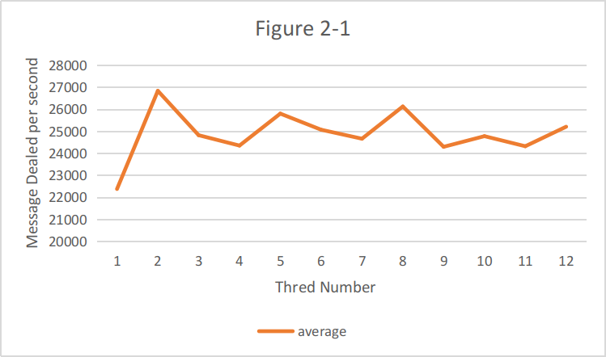
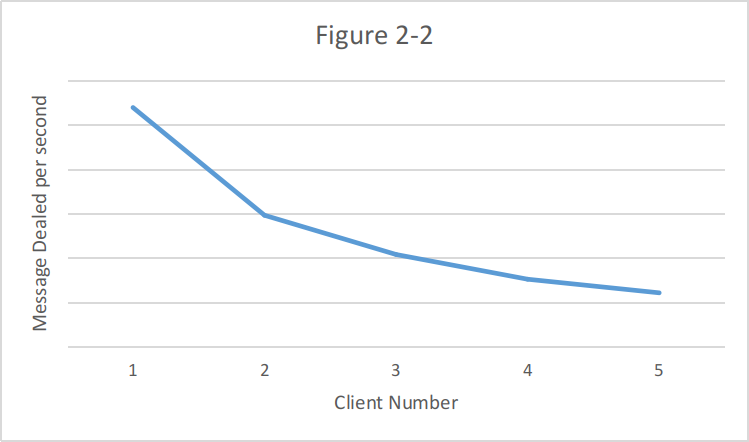

# Cloud Computing  Test report Lab2
## 1. Overview

### 1.1 Hypertext Transport Protocol

The Hypertext Transport Protocol (HTTP) is the most commonly used application protocol on the Internet today. Like many network protocols, HTTP uses a client-server model. An HTTP client opens a network connection to an HTTP server and sends an HTTP request message. Then, the server replies with an HTTP response message, which usually contains some resource (file, text, binary data) that was requested by the client. We briefly introduce the HTTP message format and structure in this section for your convenience. 

Our repo link: https://github.com/BangboLiang/CCLab-YouJiSuan.git

### 1.2 Compile Environment
Socket C++

### 1.3 How we used multi-threads

We used one thread to create socket, bind and begin listen. And many threads of one kind to deal with the request messages and send the response. We used lock and semaphore.

### 1.4 Specify parameters
The program should enable long options to accept parameters and specify these parameters during startup. They are --ip, --port and --number-thread.

1.	--ip	-the ip address that server bind.
2.	--port	-the port number that server use.
3.	--number-thread -the number of threads that server use(exclude the socket thread).

### 1.5 Run the HTTP server
After compile, use ./httpserver to Run the program.
The default ip is 127.0.0.1, and port is 9999.
Default Thread number is 1.

### 1.6 Lab Environment

OS: Arch Linux (Core version 5.11.11)
CPU:Intel(R) Core(TM) i7-8700 CPU @ 3.20GHz 6physical cores, 12 logical cores.
RAM: 16GB Dual Channel Memory

## 2. Performance Testing

### 2.1 Performance under different number of threads

Figure 2-1 shows the performance of the server program when processing HTTP messages for the same number of clients under different threads. It can be seen that the overall speed of multithreading is faster than that of a single thread, but multithreading does not increase the speed due to the increase in the number of threads. And you can see that with the exception of 5 and 6 threads, the speed of even-numbered threads is faster than odd-numbered threads.

### 2.2 Performance under different numbers of clients

Figure 2-2 shows the number of HTTP packets that the server can process per second under different numbers of clients. It can be seen that as the number of concurrent clients increases, the average number of packets that each client can receive per second Decreasing.